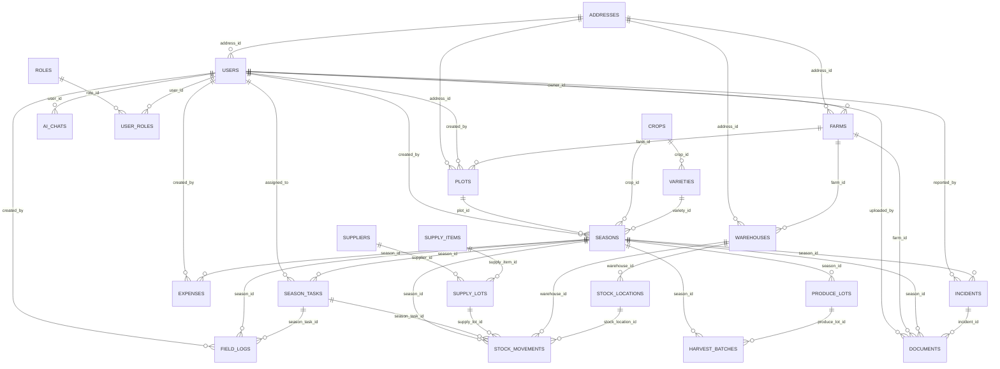

# Technical Specification: Seasonal Management System with AI Assistant

> This document converts the project report into an implementation-ready blueprint for **MySQL schema + Spring Boot REST APIs + Gemini-powered AI assistant**. The functional scope covers farm/plot/crop/variety, seasons, tasks, field logs, expenses, harvest/produce lots, incidents, documents, inventory (supplies + stock movements), and AI chat history.

---

## 1) System Overview & Actors

### 1.1 Purpose & Core Modules
The system manages agricultural production by structuring data around **Farm → Plot → Season**, with operational tracking through **Tasks, Field Logs, Expenses, Harvest**, plus **Inventory traceability** and an integrated **AI Q&A assistant**.

### 1.2 High-level Architecture
- **Backend**: Java Spring Boot REST API (Controller–Service–Repository).
- **Database**: MySQL (InnoDB), UTF8MB4 collation.
- **Frontend**: React + TypeScript (not in scope for this spec, but API-oriented routing exists).
- **AI**: Gemini API integration, with chat history persisted in `ai_chats`.

### 1.3 Actors & RBAC

#### Roles (stored in DB)
Roles are managed via `roles` and assigned via `user_roles`.

| Actor | Role Code | Description |
|---|---|---|
| Admin | `ADMIN` | System-wide configuration and oversight; can manage all farms, users, and reference catalogs. |
| Farmer | `FARMER` | Manages own farms/plots/seasons; records logs, expenses, harvest, inventory usage; uses AI assistant. |

**[Suggested]** Add granular permissions later (e.g., `FARM_MANAGER`, `WAREHOUSE_CLERK`) when the project expands.

#### AI Chatbot (System Actor)
- Not a human user role; treated as an **internal integration** using a **Gemini API Key**.
- Interacts through an API endpoint (e.g., `/api/v1/ai-chats/query`) and persists Q/A to `ai_chats`.

### 1.4 Permission Matrix (RBAC)

| Capability | ADMIN | FARMER |
|---|---:|---:|
| Manage users & assign roles | ✅ | ❌ |
| CRUD crop catalog & varieties | ✅ | ❌ *(read-only allowed)* |
| CRUD farms/plots (all tenants) | ✅ | ❌ |
| CRUD farms/plots (own tenant) | ✅ | ✅ |
| Create/close seasons, generate schedule/tasks | ✅ | ✅ |
| CRUD season tasks & update status | ✅ | ✅ *(own tenant)* |
| Create field logs, attach evidence | ✅ | ✅ *(own tenant)* |
| Create expenses & view totals | ✅ | ✅ *(own tenant)* |
| Create harvest batches & produce lots | ✅ | ✅ *(own tenant)* |
| Manage warehouses/stock/inputs | ✅ | ✅ *(own tenant)* |
| Manage incidents & documents | ✅ | ✅ *(own tenant)* |
| Use AI assistant & view own chat history | ✅ | ✅ |

---

## 2) Database Schema Design (Core Logic)

### 2.1 Database Settings
- Schema: `quanlymuavu`
- Charset/Collation: `utf8mb4 / utf8mb4_unicode_ci`
- Engine: InnoDB
- Foreign keys enabled.

### 2.2 Entities (23 tables)
Tables included:
`users, roles, user_roles, farms, addresses, plots, crops, varieties, seasons, season_tasks, field_logs, expenses, harvest_batches, documents, incidents, warehouses, stock_locations, supply_items, suppliers, supply_lots, stock_movements, produce_lots, ai_chats`.

### 2.3 ERD (Mermaid.js)



### 2.4 Data Dictionary (Tables, Keys, Indexes)

#### 2.4.1 Master / RBAC
- **`addresses`**
  - PK: `id BIGINT`
  - Columns: `full_text TEXT NOT NULL`, timestamps
  - Purpose: normalized address text (shared by users/farms/plots/warehouses).
- **`roles`**
  - PK: `role_id BIGINT`
  - Unique: `role_code` (e.g., ADMIN, FARMER).
- **`users`**
  - PK: `user_id BIGINT`
  - Unique: `user_name`, `email`
  - FK: `address_id → addresses.id` (SET NULL)
  - Status default `ACTIVE`.
- **`user_roles`**
  - Composite PK: `(user_id, role_id)`
  - FK: user CASCADE, role RESTRICT.

#### 2.4.2 Farm / Land
- **`farms`**
  - PK: `farm_id`
  - FK: `owner_id → users.user_id` (RESTRICT), `address_id → addresses.id` (SET NULL)
  - Index: `idx_farms_owner_id`.
- **`plots`**
  - PK: `plot_id`
  - FK: `farm_id → farms.farm_id` (CASCADE), `address_id` (SET NULL), `created_by → users.user_id` (SET NULL)
  - Important columns: `soil_type VARCHAR(50)`, `status VARCHAR(30) default IN_USE`.

#### 2.4.3 Crop Catalog
- **`crops`**
  - PK: `crop_id`
  - Unique: `crop_name`.
- **`varieties`**
  - PK: `variety_id`
  - FK: `crop_id → crops.crop_id` (RESTRICT)
  - Unique: `(crop_id, name)`.

#### 2.4.4 Seasonal Production
- **`seasons`**
  - PK: `season_id`
  - FK: `plot_id → plots.plot_id` (RESTRICT), `crop_id → crops.crop_id` (RESTRICT), `variety_id` (SET NULL), `created_by` (SET NULL)
  - Dates: `start_date (NOT NULL)`, `planned_harvest_date`, `end_date`
  - Yield fields: expected/actual kg, plant counts
  - Status default `ACTIVE`.

- **`season_tasks`**
  - PK: `season_task_id`
  - FK: `season_id → seasons.season_id` (CASCADE), `assigned_to → users.user_id` (SET NULL)
  - Dates: planned/due, actual start/end
  - Status default `TODO`.

- **`field_logs`**
  - PK: `field_log_id`
  - FK: `season_id` (CASCADE), optional `season_task_id` (SET NULL), `created_by` (SET NULL)
  - Columns: `log_date DATE`, `log_type VARCHAR(50)`, `evidence_url TEXT`.

- **`expenses`**
  - PK: `expense_id`
  - FK: `season_id` (CASCADE), `created_by` (SET NULL)
  - Monetary fields: `unit_price`, `quantity`, `total_cost`
  - **Rule**: `total_cost = unit_price * quantity` (enforce in service).

- **`produce_lots`**
  - PK: `produce_lot_id`
  - FK: `season_id` (CASCADE)
  - Unique: `lot_code`.

- **`harvest_batches`**
  - PK: `harvest_batch_id`
  - FK: `season_id` (CASCADE), optional `produce_lot_id` (SET NULL)
  - Columns: `harvest_date`, `quantity_kg`, `grade`.

#### 2.4.5 Incidents & Documents
- **`incidents`**
  - PK: `incident_id`
  - FK: `season_id` (CASCADE), `reported_by` (SET NULL)
  - Columns: `incident_type`, `severity`, `status default OPEN`, `deadline`, `resolved_at`.
- **`documents`**
  - PK: `document_id`
  - Optional links: `farm_id`, `season_id`, `incident_id`
  - Versioning: `version INT default 1`, `tags VARCHAR(255)`
  - FK: uploader → users.

#### 2.4.6 Inventory / Supply Chain
- **`suppliers`**: supplier master.
- **`supply_items`**: inputs master; `restricted_flag` for controlled items.
- **`supply_lots`**: batch/expiry tracking; FK to item and supplier; status default `IN_STOCK`.
- **`warehouses`**: per farm; type `INPUT / PRODUCE / MIXED`.
- **`stock_locations`**: within warehouse (zone/aisle/shelf/bin).
- **`stock_movements`**
  - Represents inventory events; links to `supply_lot` and `warehouse`, optional `stock_location`
  - `movement_type VARCHAR(10) NOT NULL` with comment `IN / OUT / TRANSFER`
  - Optional linkage to `season_id` and `season_task_id` for traceability of usage.

#### 2.4.7 AI History
- **`ai_chats`**: stores Q/A with `model` and timestamp; FK to users.

### 2.5 Indexing Guidance
Existing indexes are defined in the DDL (FK indexes, unique keys).

**[Suggested] Additional composite indexes (performance at scale):**
- `seasons(plot_id, status, start_date)`
- `season_tasks(season_id, status, due_date)`
- `field_logs(season_id, log_date)`
- `expenses(season_id, expense_date)`
- `stock_movements(supply_lot_id, warehouse_id, movement_date)`
- `documents(farm_id, season_id, incident_id, updated_at)`

---

## 3) Detailed Business Logic Flows

### 3.1 Authentication & RBAC Flow
Backend supports auth and role-based access control with JWT + RBAC. Also includes refresh token behaviors and “logout all devices” in the report.

**Flow: Sign-in**
1. Validate credentials.
2. Issue **Access JWT** (short TTL) + **Refresh Token** (longer TTL).
3. Return role claims (from `user_roles` join `roles`) for authorization decisions.

**[Suggested]** Add tables `refresh_tokens` and `audit_logs` to implement rotation/blacklist and “logout all devices” precisely (the current DDL does not include token persistence).

### 3.2 Farm Creation Flow
1. User (Farmer/Admin) submits farm details:
   - `farm_name`, optional `area`, optional `address.full_text`.
2. Persist:
   - Insert into `addresses` (if address provided).
   - Insert into `farms` with `owner_id = current_user.user_id`.
3. Authorization:
   - FARMER can only create/read/update/delete farms where `farms.owner_id = current_user`.
   - ADMIN can access all.

### 3.3 Plot Registration Flow
1. Select `farm_id` (must belong to user unless ADMIN).
2. Validate:
   - `plots.area > 0` (if provided)
   - `plots.status` in allowed set.
3. Insert into `plots` with `created_by = current_user`.

### 3.4 Season Initialization Flow (Blueprint)
This is the system’s most critical workflow.

**Inputs**
- `plot_id`, `crop_id`, optional `variety_id`
- `start_date`, optional `planned_harvest_date`
- optional `initial_plant_count`, `expected_yield_kg`, notes

**Steps**
1. **Land selection**
   - Fetch plot; verify tenant ownership; verify plot status is usable (e.g., `IN_USE`).
2. **Soil condition validation**
   - Current schema provides `plots.soil_type` only.
   - **[Suggested]** Validate that `soil_type` is present for crops requiring it, or add a `soil_tests` table later.
3. **Crop & variety validation**
   - Ensure `crop_id` exists.
   - If `variety_id` provided: verify it belongs to the crop (`varieties.crop_id = crop_id`).
4. **Active season constraint**
   - Ensure no other season on the same `plot_id` with status in `{PLANNED, ACTIVE}`.
   - Enforce in a **transaction**: `SELECT ... FOR UPDATE` on plot + check active season rows.
   - **[Suggested]** Implement as service-level invariant (MySQL partial unique indexes are not available).
5. **Automated schedule/template generation**
   - Create a default set of `season_tasks` from crop-specific templates (e.g., soil prep, sowing, fertilizing, irrigation, pest scouting, harvest).
   - Persist tasks linked to the new season.
   - **[Suggested]** Add `task_templates` & `task_template_items` for reusability; otherwise keep hardcoded per crop in code/config.
6. **DB persistence**
   - Insert row in `seasons`.
   - Insert generated rows in `season_tasks`.
7. Return season details + generated tasks.

### 3.5 Task Lifecycle Flow
- Status progression **[Suggested]**: `TODO → IN_PROGRESS → DONE` (+ `CANCELLED`)
- Rules:
  - `actual_start_date` set when moving to `IN_PROGRESS`
  - `actual_end_date` set when moving to `DONE`
  - Cannot set `actual_end_date < actual_start_date`

### 3.6 Field Log Flow (Traceability)
Logs can link to a season and optionally to a task.
- Validate season belongs to user’s tenant
- Validate `log_date` within season timeframe:
  - `log_date >= seasons.start_date`
  - If `seasons.end_date` exists: `log_date <= end_date` (**unless** log is “post-harvest audit” → [Suggested] allow with flag)
- Evidence handling:
  - `evidence_url` stores object storage URL (S3/GCS/MinIO). **[Suggested]** enforce signed URL creation server-side.

### 3.7 Expense Flow
Expenses belong to a season.
- Rule: `total_cost` must equal `unit_price * quantity` (rounding rules applied).
- Reporting:
  - Total cost per season: `SUM(total_cost)`
  - Cost trend: group by `expense_date`

### 3.8 Harvest & Produce Lot Flow
Produce lots track traceable batches; harvest batches record dated yields.
- Rules:
  - `harvest_date >= seasons.start_date`
  - If `planned_harvest_date` exists, allow ± configurable window (**[Suggested]** default ±30 days)
  - `quantity_kg > 0`
- Aggregation:
  - `seasons.actual_yield_kg = SUM(harvest_batches.quantity_kg)` (update on write or compute on read; choose one approach consistently)

### 3.9 Incident Management Flow
Incidents belong to a season and can have a deadline/resolution time.
- **[Suggested]** Status: `OPEN → IN_PROGRESS → RESOLVED → CLOSED`
- Optional automation:
  - When incident created with severity HIGH, auto-create a season task “Mitigation action” assigned to owner/manager.

### 3.10 Inventory & Stock Movement Flow
Inventory modules include warehouses, stock locations, supply items/lots, and stock movements.

**Stock balance model**
- Source of truth is `stock_movements`.
- Current balance (per `supply_lot_id` + `warehouse_id` + optional `stock_location_id`):
  - `balance = SUM(IN) - SUM(OUT)`
- Constraints:
  - For `OUT`: must not drive balance below 0.
  - For `IN`: quantity must be > 0.
  - If `supply_lots.expiry_date < movement_date` then OUT is rejected (**[Suggested]**; depends on business policy).

**TRANSFER**
- DDL lists `movement_type = TRANSFER` but does not contain destination columns.
- **[Suggested] Implementation options:**
  1. **Preferred**: extend schema with `to_warehouse_id`, `to_stock_location_id`, and `transfer_ref`.
  2. **No-schema-change**: represent a transfer as **two rows**:
     - `OUT` from source, `IN` to destination, linked via the same `note`/`transfer_ref` encoded in `note`.

**Season traceability**
- When supplies are consumed for a task, create `stock_movements` referencing `season_id` and `season_task_id`.

### 3.11 Document Management Flow
Documents support optional linking to a farm, season, and/or incident, and include tags + version field.
- Versioning rule:
  - On update, increment `version` by 1 (**unless** update is “metadata only” → [Suggested]).
- **[Suggested]** For full auditability, add `document_versions` table; otherwise store latest only.

### 3.12 AI Assistant RAG Flow (Gemini)

**Flow: User asks crop disease / operation question**
1. **Input**: `question`, optional `farm_id / season_id / plot_id`, language, user context.
2. **Context retrieval (RAG)**
   - Query DB for relevant structured context:
     - Season summary (crop/variety, dates, yield targets)
     - Recent field logs (last N days)
     - Open incidents
     - Documents linked to season/farm (guidelines, SOPs)
3. **[Suggested] Vector retrieval**
   - Current schema stores raw document content but has no embeddings tables.
   - Recommended: store embeddings in an external vector DB (e.g., pgvector, Milvus, Pinecone) or add `document_chunks` with embedding vectors.
4. **Prompt assembly**
   - Combine retrieved context + user question + safety constraints.
5. **Gemini completion**
   - Call Gemini using server-side API key; enforce rate limits per user.
6. **Persistence**
   - Store `question`, `answer`, and `model` in `ai_chats`.
7. **Optional actionization** (**[Suggested]**)
   - If answer contains actionable steps, offer “Create tasks” or “Create incident” with user confirmation.

---

## 4) API Architecture Plan

### 4.1 API Conventions
- Base path: `/api/v1`
- Auth: `Authorization: Bearer <access_token>`
- Content-Type: `application/json`
- Pagination: `?page=1&pageSize=20`
- Sorting: `?sort=createdAt,desc`
- Filtering: `?status=ACTIVE&farmId=...`
- Error format (**[Suggested]**):
  ```json
  { "code": "VALIDATION_ERROR", "message": "…", "details": [{ "field": "startDate", "reason": "…" }] }
  ```

### 4.2 REST Endpoints (by module)

#### Auth
| Method | Endpoint | Description | Required Payload/Params |
|---|---|---|---|
| POST | `/auth/sign-up` | Register user | `{ userName, email, password, fullName }` |
| POST | `/auth/sign-in` | Login | `{ emailOrUserName, password }` |
| POST | `/auth/refresh` | Refresh access token | `{ refreshToken }` |
| POST | `/auth/logout` | Logout current session | *(token required)* |
| POST | `/auth/logout-all` | Logout all devices (**[Suggested] needs token store**) | *(token required)* |
| POST | `/auth/change-password` | Change password | `{ oldPassword, newPassword }` |
| POST | `/auth/reset-password` | Reset password (**[Suggested] OTP/email flow**) | `{ email, otp, newPassword }` |

#### Users & Roles (Admin)
| Method | Endpoint | Description | Required Payload/Params |
|---|---|---|---|
| GET | `/users` | List users (ADMIN) | `?q=&status=` |
| GET | `/users/{userId}` | Get user | path |
| PATCH | `/users/{userId}` | Update profile/status | `{ fullName?, phone?, status? }` |
| GET | `/roles` | List roles |  |
| POST | `/roles` | Create role | `{ roleCode, roleName, description }` |
| POST | `/users/{userId}/roles` | Assign roles to user | `{ roleIds: [] }` |

#### Addresses
| Method | Endpoint | Description | Required Payload/Params |
|---|---|---|---|
| POST | `/addresses` | Create address | `{ fullText }` |
| GET | `/addresses/{id}` | Get address | path |
| PATCH | `/addresses/{id}` | Update address | `{ fullText }` |

#### Farms
| Method | Endpoint | Description | Required Payload/Params |
|---|---|---|---|
| POST | `/farms` | Create farm | `{ farmName, area?, addressFullText? }` |
| GET | `/farms` | List farms (tenant scoped) | `?ownerId=` (ADMIN only) |
| GET | `/farms/{farmId}` | Farm detail | path |
| PATCH | `/farms/{farmId}` | Update farm | `{ farmName?, area?, status? }` |
| DELETE | `/farms/{farmId}` | Archive/delete farm (**[Suggested] soft delete**) | path |

#### Plots
| Method | Endpoint | Description | Required Payload/Params |
|---|---|---|---|
| POST | `/plots` | Create plot | `{ farmId, plotName?, area?, soilType?, status? }` |
| GET | `/plots` | List plots | `?farmId=&status=` |
| GET | `/plots/{plotId}` | Plot detail | path |
| PATCH | `/plots/{plotId}` | Update plot | `{ plotName?, area?, soilType?, status? }` |

#### Crops & Varieties
| Method | Endpoint | Description | Required Payload/Params |
|---|---|---|---|
| GET | `/crops` | List crops |  |
| POST | `/crops` | Create crop (ADMIN) | `{ cropName, description? }` |
| GET | `/varieties` | List varieties | `?cropId=` |
| POST | `/varieties` | Create variety (ADMIN) | `{ cropId, name, description? }` |

#### Seasons
| Method | Endpoint | Description | Required Payload/Params |
|---|---|---|---|
| POST | `/seasons` | Create season + generate tasks | `{ plotId, cropId, varietyId?, startDate, plannedHarvestDate?, initialPlantCount?, expectedYieldKg?, notes? }` |
| GET | `/seasons` | List seasons | `?farmId=&plotId=&status=` |
| GET | `/seasons/{seasonId}` | Season detail | path |
| PATCH | `/seasons/{seasonId}` | Update season | `{ seasonName?, plannedHarvestDate?, endDate?, status?, notes? }` |
| POST | `/seasons/{seasonId}/close` | Close season | `{ endDate }` |

#### Season Tasks
| Method | Endpoint | Description | Required Payload/Params |
|---|---|---|---|
| POST | `/season-tasks` | Create task | `{ seasonId, title, description?, plannedDate?, dueDate?, assignedTo? }` |
| GET | `/season-tasks` | List tasks | `?seasonId=&status=&assignedTo=` |
| PATCH | `/season-tasks/{taskId}` | Update task/status | `{ status?, dueDate?, assignedTo?, actualStartDate?, actualEndDate?, notes? }` |

#### Field Logs
| Method | Endpoint | Description | Required Payload/Params |
|---|---|---|---|
| POST | `/field-logs` | Create field log | `{ seasonId, seasonTaskId?, logDate, logType, notes?, evidenceUrl? }` |
| GET | `/field-logs` | List logs | `?seasonId=&from=&to=&logType=` |
| PATCH | `/field-logs/{logId}` | Update log | `{ notes?, evidenceUrl? }` |

#### Expenses
| Method | Endpoint | Description | Required Payload/Params |
|---|---|---|---|
| POST | `/expenses` | Create expense | `{ seasonId, itemName, unitPrice, quantity, expenseDate, note? }` |
| GET | `/expenses` | List expenses | `?seasonId=&from=&to=` |
| GET | `/expenses/summary` | Cost summary | `?seasonId=` |

#### Produce Lots & Harvest
| Method | Endpoint | Description | Required Payload/Params |
|---|---|---|---|
| POST | `/produce-lots` | Create produce lot | `{ seasonId, lotCode }` |
| GET | `/produce-lots` | List produce lots | `?seasonId=&status=` |
| POST | `/harvest-batches` | Create harvest batch | `{ seasonId, produceLotId?, harvestDate, quantityKg, grade?, note? }` |
| GET | `/harvest-batches` | List harvest batches | `?seasonId=&from=&to=` |

#### Incidents
| Method | Endpoint | Description | Required Payload/Params |
|---|---|---|---|
| POST | `/incidents` | Report incident | `{ seasonId, incidentType?, severity?, description, deadline? }` |
| GET | `/incidents` | List incidents | `?seasonId=&status=&severity=` |
| PATCH | `/incidents/{incidentId}` | Update incident | `{ status?, deadline?, resolvedAt?, description? }` |

#### Documents
| Method | Endpoint | Description | Required Payload/Params |
|---|---|---|---|
| POST | `/documents` | Upload/create document | `{ title, content?, fileUrl?, tags?, farmId?, seasonId?, incidentId? }` |
| GET | `/documents` | Search/list documents | `?farmId=&seasonId=&incidentId=&tags=` |
| PATCH | `/documents/{documentId}` | Update document (increments version) | `{ title?, content?, fileUrl?, tags? }` |

#### Inventory: Suppliers, Items, Lots, Warehouses, Locations, Movements
| Method | Endpoint | Description | Required Payload/Params |
|---|---|---|---|
| POST | `/suppliers` | Create supplier | `{ name, licenseNo?, contactEmail?, contactPhone? }` |
| POST | `/supply-items` | Create supply item | `{ name, activeIngredient?, unit?, restrictedFlag? }` |
| POST | `/supply-lots` | Create supply lot | `{ supplyItemId, supplierId?, batchCode?, expiryDate? }` |
| POST | `/warehouses` | Create warehouse | `{ farmId, name, type?, addressFullText? }` |
| POST | `/stock-locations` | Create stock location | `{ warehouseId, zone?, aisle?, shelf?, bin? }` |
| POST | `/stock-movements` | Create movement | `{ supplyLotId, warehouseId, stockLocationId?, movementType, quantity, seasonId?, seasonTaskId?, note? }` |
| GET | `/stock-movements` | List movements | `?warehouseId=&supplyLotId=&seasonId=&from=&to=` |
| GET | `/inventory/balance` | Compute balance | `?warehouseId=&supplyLotId=&stockLocationId?` |

#### AI Chats
| Method | Endpoint | Description | Required Payload/Params |
|---|---|---|---|
| POST | `/ai-chats/query` | Ask AI assistant (Gemini) + persist | `{ question, farmId?, seasonId?, language? }` |
| GET | `/ai-chats` | List chat history | `?userId=` (ADMIN only) or self |
| GET | `/ai-chats/{aiChatId}` | Get chat record | path |

---

## 5) Edge Cases & Validation Rules

### 5.1 Temporal & State Constraints
- **Harvest date cannot be before planting/start date**:
  - `harvest_batches.harvest_date >= seasons.start_date`.
- **Season end date cannot be before start date**:
  - `seasons.end_date >= seasons.start_date`.
- **Cannot start a new season on a plot with an active ongoing season**:
  - Enforce: only one season per plot where `status ∈ {PLANNED, ACTIVE}` (**service-level invariant**).

### 5.2 Referential & Tenant Isolation
- FARMER access must be tenant-scoped:
  - farm scope: `farms.owner_id == current_user.user_id`
  - plot scope: join via farm
  - season/task/log/expense/harvest/incidents/documents scope: join via season → plot → farm
- Admin bypasses tenant filter.

### 5.3 Inventory Safety & Consistency
- **Inventory deduction must prevent negative stock**:
  - For OUT: compute current balance for `(supply_lot_id, warehouse_id, stock_location_id)` then ensure `balance - quantity >= 0`.
- Quantity rules:
  - `quantity > 0` for all movements
  - `movement_type ∈ {IN, OUT, TRANSFER}`.
- **Restricted supplies**:
  - If `supply_items.restricted_flag = 1`, require ADMIN (or a future permission).

### 5.4 Data Quality Rules
- Unique constraints must be honored:
  - `users.email`, `users.user_name` unique.
  - `crops.crop_name` unique.
  - `produce_lots.lot_code` unique.
- Expenses:
  - `total_cost` must match calculation; reject mismatches or ignore client-provided value and compute server-side.

### 5.5 Concurrency & Idempotency
- Season creation and “active-season-per-plot” checks must run in a DB transaction to avoid race conditions.
- **[Suggested]** For stock movements, support idempotency key:
  - Header: `Idempotency-Key`
  - Prevent duplicate movement writes on retries.

### 5.6 AI Safety & Reliability (Engineering Rules)
- Rate limit `/ai-chats/query` per user (e.g., 30/min).
- Enforce prompt constraints:
  - Must cite retrieved context snippets (internally) and avoid hallucinated “facts”.
- **[Suggested]** Provide “confidence + sources” fields in response:
  - `{ answer, confidence, referencedEntities: { seasonId, incidentIds, documentIds } }`
- Persist Q/A into `ai_chats` for auditability.

---

### Appendix A — Enumerations (Recommended)
**[Suggested]** Since the schema uses `VARCHAR` statuses, standardize enums in code (and validate strictly):

- `users.status`: `ACTIVE | INACTIVE | SUSPENDED`
- `farms.status`: `ACTIVE | ARCHIVED`
- `plots.status`: `IN_USE | IDLE | ARCHIVED`
- `seasons.status`: `PLANNED | ACTIVE | COMPLETED | CANCELLED`
- `season_tasks.status`: `TODO | IN_PROGRESS | DONE | CANCELLED`
- `incidents.status`: `OPEN | IN_PROGRESS | RESOLVED | CLOSED`
- `supply_lots.status`: `IN_STOCK | DEPLETED | EXPIRED | ARCHIVED`
- `produce_lots.status`: `CREATED | PACKED | SOLD | DISCARDED`
- `stock_movements.movement_type`: `IN | OUT | TRANSFER`
